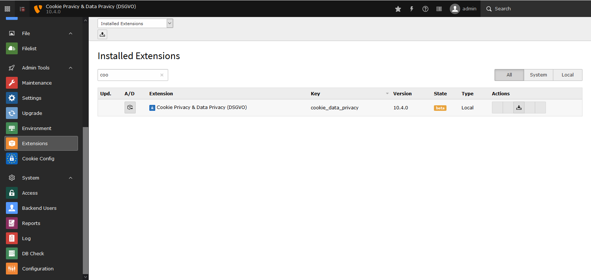
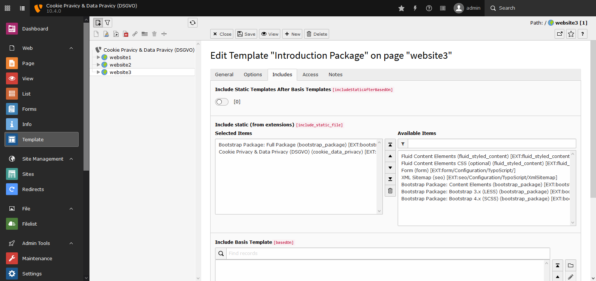
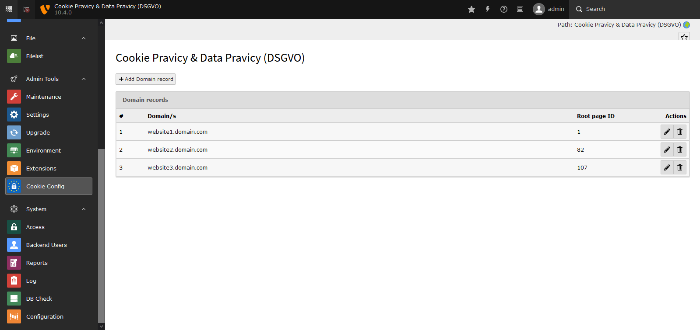
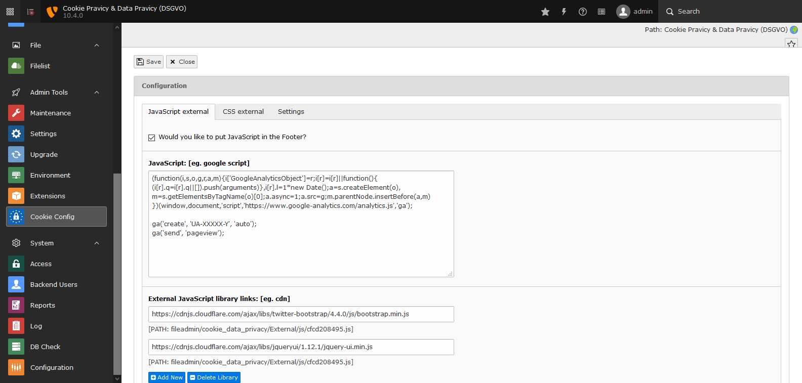
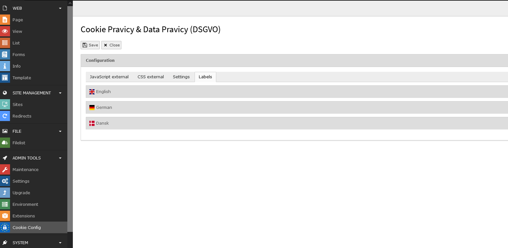

.. include:: ../Includes.txt

.. _adminmanual:

====================
Administrator Manual
====================

.. _admin-installation:

Installation
============

You need to follow the steps to install the extension.

- Download `vhs <https://extensions.typo3.org/extension/vhs>`__ dependency extension from TYPO3 Extension Repository and install the extension from extension manager.
- Download cookie_data_privacy extension from TYPO3 Extension Repository.
- Install the extension from extension manager.

Static Templates
================

Add cookie_data_privacy static template

.. important::

   You can change the default language label from constants.

.. _admin-configuration:

Backend Configuration
=====================

Add your domain and root page ID to support multi-domain.

Configuration for external JS libraries, Google Analytics script, ga('send') click count scripts, external CSS libraries like bootstrap, google fonts, settings about cookie bar

The cookie messages/labels can be set from backend as shown in the screenshot.

.. important::

    Please donot forget to take backend of constants labels, now labels can be set from backend so we have removed from constants.
    Note: If you have been used your template for this extension then please update your extension/view/template eg. Templates/ShowCase/Show.html

.. important::

   Donot forget to Clear frontend caches and Clear all system-related caches (Flush all caches)